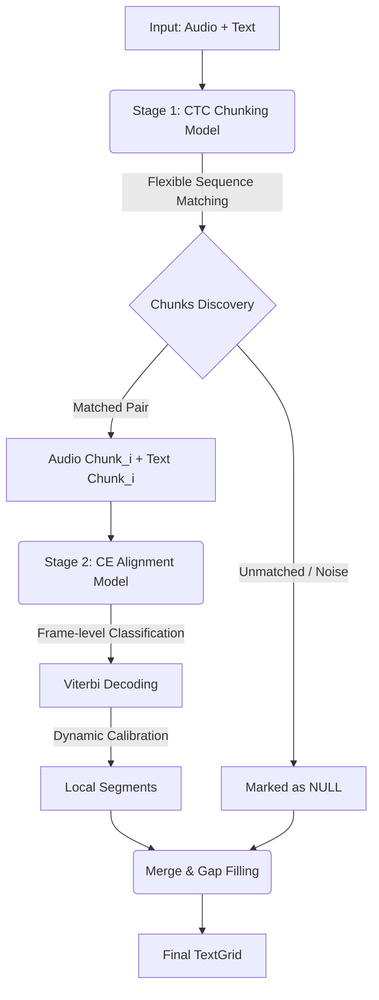

<div align="center">

# 🌊 FlexAligner
### Robust Speech-Text Alignment from Signal to Symbol

[](http://phonetics.ustc.edu.cn/)
[](https://www.python.org/)
[](LICENSE)
[](https://huggingface.co/)

**A Deep Learning Framework for "Wild" Real-World Data**
<br>
**面向真实世界数据的深度学习强鲁棒性强制对齐工具**

[**English**](#-introduction) | [**简体中文**](#-简介)

</div>

---

## 👨‍💻 Authors & Affiliation

* **Yiming Wang (王一鸣)** - *University of Science and Technology of China (USTC)*
* **Jiahong Yuan (袁家宏)** - *University of Science and Technology of China (USTC)*

> **Cite as:** Yiming Wang & Jiahong Yuan, *The USTCPhonetics FlexAligner* (2026).

---

## 📖 Introduction

**FlexAligner** is a robust speech-text alignment framework designed to supersede traditional HMM-GMM approaches (like MFA) in the deep learning era.

In real-world linguistics research, audio and transcription are rarely strictly matched. Insertions (laughter/noise), deletions (missing words), and transcription drift often cause "domino effect" errors in traditional aligners.

**FlexAligner decomposes the alignment problem into two stages:**
1.  **Global Chunking (Macro):** Discovering reliable "islands" of matched speech.
2.  **Local Alignment (Micro):** Refining boundaries with sub-millisecond precision.

### 🌟 Key Features

* **🛡️ Tolerance to Mismatch:** Unlike MFA, FlexAligner utilizes **CTC Chunking** to intelligently detect and skip unrelated audio segments (e.g., laughter, noise, or unannotated speech), labeling them as `<NULL>`.
* **⚡ Dynamic Precision Calibration (New):** Features a self-calibrating time decoder that eliminates cumulative floating-point drift in long audio files, ensuring strict synchronization between phonetic boundaries and physical sampling points.
* **🧠 Neural-Based:** Powered by **wav2vec 2.0**, capturing acoustic nuances beyond spectral features.

---

## 🌏 简介

**FlexAligner** 是一个面向深度学习时代的强鲁棒性语音-文本对齐框架。

在真实的语言学研究中，音频与文本往往难以严格对应。传统对齐器（如 MFA）在面对噪音、笑声或漏记单词时，往往会强制拉伸音素以填满音频，导致灾难性的对齐错误。

**FlexAligner 将对齐问题解耦为两个阶段：**
1.  **宏观切分 (Chunking):** 在混乱的数据中寻找可靠的“对齐岛屿”。
2.  **微观对齐 (Alignment):** 在岛屿内部进行基于物理采样点的高精度边界回归。

### 核心优势

* **🛡️ 强鲁棒性：** 利用 **CTC** 机制自动感知“转写-音频”的不匹配，自动过滤非言语声音，仅对齐可靠部分。
* **⚡ 动态精度校准 (Dynamic Precision):** 引入自适应步长算法，消除了长音频处理中的累积时间漂移（Drift），确保音素边界与神经信号（EEG/MEG）在物理时间轴上的严格同步。
* **🧠 深度特征：** 基于 **wav2vec 2.0**，充分利用预训练模型的声学表征能力。

---

## 🏗️ Architecture Overview

The pipeline consists of two wav2vec 2.0 models trained with distinct objectives:


🚀 Installation
```Bash
# Clone the repository

git clone [https://github.com/USTCPhonetics/FlexAligner.git](https://github.com/USTCPhonetics/FlexAligner.git)
cd FlexAligner
``` 

<table style="width:100%"> <thead> <tr> <th style="text-align:left">Stage</th> <th style="text-align:left">Goal</th> <th style="text-align:left">Mechanism</th> </tr> </thead> <tbody> <tr> <td><strong>Stage 1</strong></td> <td><strong>Chunking</strong></td> <td><strong>CTC Loss.</strong> Tolerates insertions/deletions. Produces coarse alignments to identify matched regions.</td> </tr> <tr> <td><strong>Stage 2</strong></td> <td><strong>Alignment</strong></td> <td><strong>Cross-Entropy (CE).</strong> Frame-wise classification. Produces high-resolution boundaries using Viterbi search.</td> </tr> </tbody> </table>

```bash
# Install in editable mode

pip install -e .
```
💻 Usage
1. Command Line Interface (CLI)The easiest way to use FlexAligner.
Basic Usage:

```Bash
flex-align audio.wav text.txt
```
High-Precision Mode (Recommended for Research):Enable --dynamic to activate the dynamic step calibration, ensuring sub-millisecond accuracy for long recordings.

```Bash
flex-align audio.wav text.txt --dynamic -o result.TextGrid
```

2. Python API Designed for integration into larger research pipelines (e.g., batch processing, EEG alignment).

```Python
from flexaligner import FlexAligner
from flexaligner.config import AlignmentConfig
```

# 1. Configuration (Optional: enable dynamic precision)
```python
config = AlignmentConfig(
    device="cuda", 
    use_dynamic_hop=True
)
```
# 2. Initialize
```python
aligner = FlexAligner(config=vars(config))
```
# 3. Align
```python
# Returns a list of 'Chunk' objects containing tensors and timestamps
chunks = aligner.align("corpus/SP01.wav", "corpus/SP01.txt", "output/SP01.TextGrid")

print(f"Aligned {len(chunks)} valid segments.")
```
📜 Citation
If you use FlexAligner in your academic work, please cite:

```Text
Yiming Wang & Jiahong Yuan, The USTCPhonetics FlexAligner (2026).
```

```BibTeX
@misc{flexaligner2026,
  title   = {FlexAligner: Robust Speech–Text Alignment via CTC Chunking and Local Cross-Entropy Alignment},
  author  = {Wang, Yiming and Yuan, Jiahong},
  year    = {2026},
  publisher = {GitHub},
  journal = {GitHub repository},
  howpublished = {\url{[https://github.com/USTCPhonetics/FlexAligner](https://github.com/USTCPhonetics/FlexAligner)}},
  organization = {University of Science and Technology of China}
}
```
<div align="center"><sub>Built by the USTCPhonetics at USTC.</sub></div>