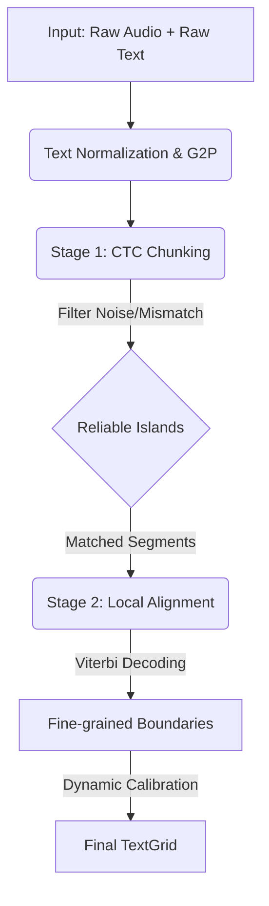

<div align="center">

# 🌊 FlexAligner
### Robust Speech-Text Alignment from Signal to Symbol

[](http://phonetics.ustc.edu.cn/)
[](https://www.python.org/)
[](LICENSE)
[](https://huggingface.co/USTCPhonetics)

**A Neural-Based Forced Alignment Framework for "Wild" Real-World Data**
<br>
**面向真实非受控数据的深度学习强鲁棒性对齐工具**

[**English**](#-introduction) | [**简体中文**](#-简介)

</div>

---

## 📖 Introduction

**FlexAligner** is a robust speech-text alignment framework built upon **wav2vec 2.0**. It is developed to address the complexities of real-world linguistic data, where audio signals and textual transcriptions often exhibit discrepancies.

In spontaneous speech or field recordings, issues such as **background noise, laughter, hesitations (insertions)**, and **transcription omissions (deletions)** pose challenges for alignment accuracy. FlexAligner addresses these by decomposing the problem into two stages:

1.  **Macro-Segmentation (CTC Chunking):** Utilizes the CTC loss mechanism to identify reliable speech segments while tolerating unannotated acoustic events.
2.  **Micro-Alignment (Local Alignment):** Performs frame-level boundary regression within matched segments using a dynamic time-calibration algorithm.

### 🌟 Key Features

* **🛡️ Tolerance to Mismatch:** FlexAligner is capable of handling imperfect alignments between audio and text. It leverages CTC to detect and treat non-speech segments (e.g., laughter, noise) as `<NULL>` tokens, reducing the risk of forced misalignment.
* **🧹 Integrated Text Normalization:** Includes a lightweight frontend for automatic punctuation removal, case normalization, and OOV (Out-Of-Vocabulary) phoneme mapping.
* **🌍 Multi-Lingual Support:** Pre-trained models available for **Mandarin Chinese** and **English**, with an architecture designed for extensibility.

---

## 🌏 简介

**FlexAligner** 是一个基于 **wav2vec 2.0** 的语音-文本对齐框架，旨在解决真实世界数据（Wild Data）中常见的非理想对齐问题。

在自然语言研究中，录音与文本往往难以严格对应。面对**噪音、笑声、语气词插入**或**文本漏记**，传统的强制对齐算法可能会受到干扰。FlexAligner 通过“分治策略”应对这一挑战：

1.  **宏观切分 (Chunking):** 利用 CTC 机制过滤非言语声音，在非受控数据中寻找可靠的“对齐锚点”。
2.  **微观对齐 (Alignment):** 在锚点内部进行基于物理采样点的高精度边界回归。

### 核心优势

* **🛡️ 鲁棒性设计：** 能够容忍音频与文本的一定程度不一致。对于未转写的笑声或噪音，系统将其标记为 `<NULL>`，而非强制匹配到邻近音素。
* **🧹 自动化前端：** 内置文本归一化模块，自动处理标点去除、大小写转换及生僻词（OOV）的模糊匹配。
* **🌍 多语言支持：** 目前已支持 **普通话 (Mandarin)** 与 **英语 (English)**。

---

## 🏗️ Architecture



🚀 Installation
```Bash

# Clone the repository
git clone [https://github.com/USTCPhonetics/FlexAligner.git](https://github.com/USTCPhonetics/FlexAligner.git)
cd FlexAligner

# Install in editable mode with all dependencies (Recommended)
# This includes tools for testing, robustness, and security checks.
pip install -e ".[all]"
```

💻 Usage
FlexAligner provides a smart unified interface. You can pass a single audio file or a batch list, and it will automatically route the task.

1. Command Line Interface (CLI)
Mode A: Single File Alignment Ideal for quick tests or individual recordings.

```Bash

# Basic usage (Auto-detects transcript from audio filename)
flexaligner demo.wav

# Specify transcript and output explicitly
flexaligner audio.wav transcript.txt -o result.TextGrid

# Force language (triggers Language Lock) and device
flexaligner en.wav en.txt -l en --device cuda
```

Mode B: High-Throughput Batch Processing Ideal for processing large-scale corpora (e.g., thousands of files).

Simply pass a .csv or .txt file list. The tool automatically switches to Batch Mode.

```Bash

# Run batch alignment
flexaligner filelist.csv --device cuda
```
📝 Batch File Format Example (filelist.csv):

```
/data/audio/001.wav                                     <-- Auto-infer text & output
/data/audio/002.wav,/data/text/002.txt                  <-- Explicit text
/data/audio/003.mp3,,/results/003_fixed.TextGrid        <-- Explicit output
```
2. Python API
Designed for seamless integration into research pipelines (e.g., slicing audio for EEG/MEG analysis).

```Python

from flexaligner import FlexAligner

# 1. Initialize (Loads model once, auto-downloads if needed)
# You can specify device="cuda" or max_gap_s here.
aligner = FlexAligner({
    "device": "cuda", 
    "lang": "zh"  # Optional: Lock language
})

# 2. Align a single file
chunks = aligner.align(
    audio_path="corpus/SP01.wav", 
    text_path="corpus/SP01.txt", 
    output_path="output/SP01.TextGrid"
)

# 3. Or align a batch list (Efficient)
tasks = [
    ("corpus/A.wav", "corpus/A.txt", "out/A.TextGrid"),
    ("corpus/B.wav", "corpus/B.txt", "out/B.TextGrid"),
]
aligner.align_batch(tasks)

print(f"✅ Processing complete.")
```
## 🗓️ Roadmap

- [x] **Core Alignment Engine:** Two-stage architecture (CTC Chunking + Local Alignment).
- [x] **Multi-Lingual Support:** Pre-trained models for Mandarin & English.
- [x] **Unified Batch Inference:** Smart CLI entry point supporting `.csv` / `.txt` file lists for high-throughput corpus processing.
    - *Usage:* `flexaligner batch_list.csv --device cuda`
- [ ] **PyPI Release:** Publish the package to the Python Package Index (PyPI) to support standard installation via `pip install flexaligner`.
- [ ] **Domain Adaptation Recipe:** Provide scripts and APIs for users to fine-tune acoustic models on specific domains (e.g., dialects, children's speech, or dysarthric speech).

👨‍💻 Authors & Affiliation
```
Yiming Wang (王一鸣) - University of Science and Technology of China (USTC)

Jiahong Yuan (袁家宏) - University of Science and Technology of China (USTC)
```
📜 Citation
If you use FlexAligner in your research, please cite:

```bibtex
@misc{flexaligner2026,
  title   = {FlexAligner: Robust Speech–Text Alignment via CTC Chunking and Local Cross-Entropy Alignment},
  author  = {Wang, Yiming and Yuan, Jiahong},
  year    = {2026},
  publisher = {GitHub},
  journal = {GitHub repository},
  howpublished = {\url{[https://github.com/USTCPhonetics/FlexAligner](https://github.com/USTCPhonetics/FlexAligner)}},
  organization = {University of Science and Technology of China}
}
```
<div align="center"><sub>Built by USTCPhonetics.</sub></div>


-----