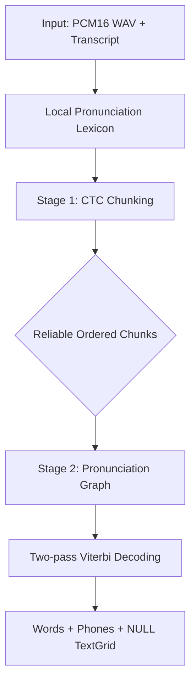

<div align="center">

# 🌊 FlexAligner

### Robust Speech-Text Alignment from Signal to Symbol

[](http://phonetics.ustc.edu.cn/)
[](https://www.python.org/)
[](LICENSE)
[](https://huggingface.co/USTCPhonetics)

**A Neural-Based Forced Alignment Framework for "Wild" Real-World Data**
<br>
**面向真实非受控数据的深度学习强鲁棒性对齐工具**

[**English**](#-introduction) | [**简体中文**](#-简介)

</div>

---

## 📖 Introduction

**FlexAligner** is a robust speech-text alignment framework built upon
**wav2vec 2.0**. It is designed for real-world linguistic data, where audio
signals and textual transcriptions may contain noise, hesitations, untranscribed
events, or local mismatches.

FlexAligner decomposes forced alignment into two stages:

1. **Macro-Segmentation (CTC Chunking):** Uses a CTC acoustic model to locate
   reliable transcript anchors and divide long-form audio into ordered chunks.
2. **Micro-Alignment (Local Alignment):** Uses a constrained pronunciation
   graph and two-pass Viterbi decoding to estimate word and phone boundaries
   within each chunk.

### 🌟 Key Features

* **🛡️ Tolerance to Mismatch:** Uncovered portions of the audio timeline are
  represented explicitly as `NULL` intervals instead of being silently forced
  into neighboring words or phones.
* **🎯 Word and Phone Boundaries:** Produces Praat TextGrid files with continuous
  `words` and `phones` tiers while preserving the input word order.
* **🔒 Local and Reproducible:** Models and pronunciation dictionaries are
  supplied as explicit local paths; alignment does not automatically download
  models or silently generate OOV pronunciations.
* **📦 Python Package and CLI:** Provides a typed Python API and a command-line
  interface for single-file alignment.

The first public preview focuses on **English, CPU, and single-file alignment**.
Mandarin, GPU, batch processing, Web services, automatic model download,
multi-format decoding, resampling, default G2P, and confidence calibration are
reserved interfaces and are not yet production features.

---

## 🌏 简介

**FlexAligner** 是一个基于 **wav2vec 2.0** 的语音—文本对齐框架，面向真实语言材料中
常见的噪音、停顿、未转写声音事件以及音频与文本局部不一致等问题。

FlexAligner 将强制对齐分为两个阶段：

1. **宏观切分（CTC Chunking）：** 使用 CTC 声学模型寻找可靠的文本锚点，并将长音频
   划分为顺序一致的局部片段。
2. **微观对齐（Local Alignment）：** 在每个片段内构建受约束的发音图，通过两遍
   Viterbi 解码估计词和音素边界。

### 🌟 核心优势

* **🛡️ 容错设计：** 对未被词或音素覆盖的时段使用明确的 `NULL` 区间表示，避免将其
  静默挤压到相邻标签中。
* **🎯 词与音素边界：** 输出 Praat TextGrid，`words` 和 `phones` 两层连续覆盖完整
  音频时间轴，同时保持输入词序。
* **🔒 本地与可复现：** 模型和发音词典均由用户显式指定；运行时不会自动下载模型，
  也不会对 OOV 词静默生成发音。
* **📦 Python 包与 CLI：** 提供带类型定义的 Python API 和单文件命令行接口。

首个公开预览版聚焦于**英语、CPU、单文件对齐**。普通话、GPU、批处理、Web 服务、
自动模型下载、多格式解码、自动重采样、默认 G2P 和置信度校准目前仅保留接口，尚未
作为正式能力开放。

---

## 🏗️ Architecture


```mermaid
graph TD
    Input[Input: PCM16 WAV + Transcript] --> Lexicon[Local Pronunciation Lexicon];
    Lexicon --> B[Stage 1: CTC Chunking];
    B --> C{Reliable Ordered Chunks};
    C --> D[Stage 2: Pronunciation Graph];
    D --> E[Two-pass Viterbi Decoding];
    E --> F[Words + Phones + NULL TextGrid];
```

## 🚀 Installation

The import-safe core package targets Python 3.10–3.14. The frozen inference
extra pins Torch 2.3.1 and Transformers 4.41.2 and is installable on Python
3.10–3.12. Real-model release evidence currently covers only Linux x86_64 with
Python 3.10.8; Python 3.13–3.14 are core-only.

After the public alpha is available from PyPI, install the exact preview with:

```bash
python -m pip install "flexaligner[inference]==0.1.0a1"
```

For a CPU-only Linux environment, install the frozen Torch build from its CPU
index first:

```bash
python -m pip install torch==2.3.1 --index-url https://download.pytorch.org/whl/cpu
python -m pip install "flexaligner[inference]==0.1.0a1"
```

To work from a reviewed source checkout:

```bash
git clone https://github.com/USTCPhonetics/FlexAligner.git
cd FlexAligner

python -m pip install -e ".[inference]"
```

The package does not include acoustic models. Prepare compatible local Chunker
and Aligner model directories and a pronunciation dictionary before alignment.

基础包支持 Python 3.10–3.14。首个 alpha 的推理依赖固定为 Torch 2.3.1 和
Transformers 4.41.2，仅支持在 Python 3.10–3.12 上安装；真实模型发布验证目前仅覆盖
Linux x86_64 与 Python 3.10.8。Python 3.13–3.14 暂时只承诺基础包和接口可用。
wheel 不包含声学模型，也不会自动下载模型；运行前必须准备本地 Chunker、Aligner
模型目录和发音词典。

## 💻 Usage

### 1. Command Line Interface (CLI)

Align one English 16 kHz mono PCM16 WAV file:

```bash
flexaligner align \
  --audio recording.wav \
  --text-file transcript.txt \
  --lexicon english.dict \
  --chunker-model /local/models/en/chunker \
  --aligner-model /local/models/en/aligner \
  --output recording.TextGrid \
  --chunk-metadata recording.alignment.json \
  --num-threads 1
```

Literal transcript text may be passed with `--text` instead of `--text-file`.
`--num-threads` configures Torch's process-global CPU thread count for the
inference lifetime; it is not isolated to a single aligner instance.
Use the capability command to inspect the installed preview:

```bash
flexaligner capabilities
flexaligner capabilities --json
```

### 2. Python API

```python
from pathlib import Path

from flexaligner import (
    AlignmentRequest,
    FlexAligner,
    LocalModelBundle,
    TextGridOutput,
)

models = LocalModelBundle(
    chunker_dir=Path("/local/models/en/chunker"),
    aligner_dir=Path("/local/models/en/aligner"),
)

with FlexAligner(
    models=models,
    lexicon_path=Path("english.dict"),
) as aligner:
    result = aligner.align(
        AlignmentRequest(
            audio_path=Path("recording.wav"),
            transcript=Path("transcript.txt").read_text(encoding="utf-8"),
            output=TextGridOutput(path=Path("recording.TextGrid")),
            utterance_id="recording",
        )
    )

print(result.output_sha256)
```

### Input Requirements / 输入要求

* Audio must be uncompressed 16 kHz mono PCM16 WAV.
* The transcript must be UTF-8 text and fully covered by the pronunciation
  dictionary.
* Model and dictionary files must be available locally.
* Output paths use no-clobber semantics: an existing output file is not
  overwritten.

* 音频必须是未压缩的 16 kHz、单声道、PCM16 WAV。
* 文本必须为 UTF-8，且发音词典需要覆盖全部输入词。
* 模型与词典必须提前保存在本地。
* 输出采用不覆盖已有文件的策略；若目标文件已存在，程序不会将其覆盖。
* `--num-threads` 会设置 Torch 的进程全局 CPU 线程数，并非仅对单个 aligner 实例生效。

## 🗓️ Roadmap

- [x] **Core Alignment Engine:** Two-stage CTC chunking and local alignment.
- [x] **English CPU Single-File Alignment:** CLI, Python API, and validated
  TextGrid output.
- [x] **Continuous TextGrid Coverage:** `words` and `phones` tiers use `NULL`
  intervals to cover the complete timeline.
- [ ] **Mandarin Alignment:** Model, segmentation, and release validation.
- [ ] **GPU and Batch Processing:** Accelerated and high-throughput workflows.
- [ ] **Audio Frontend:** Multi-format decoding and automatic resampling.
- [ ] **Model Distribution:** Documented model acquisition and compatibility
  validation.
- [ ] **PyPI Release:** Publish the approved public preview as `flexaligner`.

## 👨‍💻 Authors & Affiliation

```text
Yiming Wang (王一鸣) - University of Science and Technology of China (USTC)

Jiahong Yuan (袁家宏) - University of Science and Technology of China (USTC)
```

## 📜 Citation

If you use FlexAligner in your research, please cite:

```bibtex
@misc{flexaligner2026,
  title        = {FlexAligner: Robust Speech--Text Alignment via CTC Chunking and Local Cross-Entropy Alignment},
  author       = {Wang, Yiming and Yuan, Jiahong},
  year         = {2026},
  publisher    = {GitHub},
  journal      = {GitHub repository},
  howpublished = {\url{https://github.com/USTCPhonetics/FlexAligner}},
  organization = {University of Science and Technology of China}
}
```

## 📄 License

FlexAligner is released under the [MIT License](LICENSE). Please refer to the
repository's `LICENSE` file for the authoritative license and copyright notice.

<div align="center"><sub>Built by USTCPhonetics.</sub></div>
