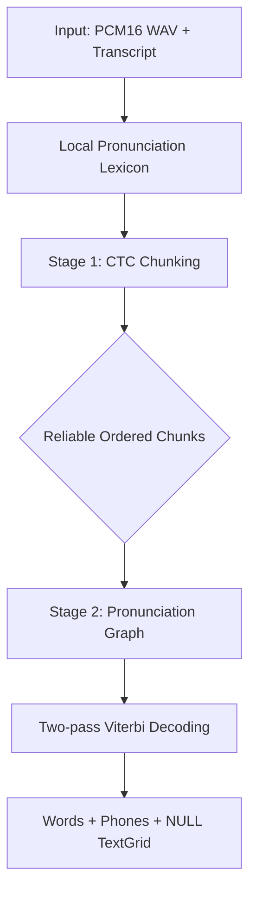

<div align="center">

# 🌊 FlexAligner

### Robust Speech-Text Alignment from Signal to Symbol

[](http://phonetics.ustc.edu.cn/)
[](https://www.python.org/)
[](LICENSE)
[](https://huggingface.co/USTCPhonetics)

**A Neural-Based Forced Alignment Framework for "Wild" Real-World Data**
<br>
**面向真实非受控数据的深度学习强鲁棒性对齐工具**

[**English**](#-introduction) | [**简体中文**](#-简介)

</div>

---

## 📖 Introduction

**FlexAligner** is a robust speech-text alignment framework built upon
**wav2vec 2.0**. It is designed for real-world linguistic data, where audio
signals and textual transcriptions may contain noise, hesitations, untranscribed
events, or local mismatches.

FlexAligner decomposes forced alignment into two stages:

1. **Macro-Segmentation (CTC Chunking):** Uses a CTC acoustic model to locate
   reliable transcript anchors and divide long-form audio into ordered chunks.
2. **Micro-Alignment (Local Alignment):** Uses a constrained pronunciation
   graph and two-pass Viterbi decoding to estimate word and phone boundaries
   within each chunk.

### 🌟 Key Features

* **🛡️ Tolerance to Mismatch:** Uncovered portions of the audio timeline are
  represented explicitly as `NULL` intervals instead of being silently forced
  into neighboring words or phones.
* **🎯 Word and Phone Boundaries:** Produces Praat TextGrid files with continuous
  `words` and `phones` tiers while preserving the input word order.
* **🔒 Local and Reproducible:** Explicit model paths remain fully local. When
  model paths are omitted, the CLI validates the pinned English bundle in the
  Hugging Face cache and asks before downloading it. English OOV pronunciations
  use a bundled local G2P checkpoint and are always reported as CLI warnings.
* **📦 Python Package and CLI:** Provides a typed Python API and a command-line
  interface for single-file alignment.

The first public preview focuses on **English, CPU, and single-file alignment**.
Mandarin, GPU, batch processing, Web services, multi-format decoding,
resampling, and confidence calibration remain reserved interfaces. Local English
OOV G2P is implemented in the current `0.2.0a1` source tree.
Validated English model retrieval is implemented in the current `0.2.0a1`
source tree and is not part of the already published `0.1.0a1` package.

---

## 🌏 简介

**FlexAligner** 是一个基于 **wav2vec 2.0** 的语音—文本对齐框架，面向真实语言材料中
常见的噪音、停顿、未转写声音事件以及音频与文本局部不一致等问题。

FlexAligner 将强制对齐分为两个阶段：

1. **宏观切分（CTC Chunking）：** 使用 CTC 声学模型寻找可靠的文本锚点，并将长音频
   划分为顺序一致的局部片段。
2. **微观对齐（Local Alignment）：** 在每个片段内构建受约束的发音图，通过两遍
   Viterbi 解码估计词和音素边界。

### 🌟 核心优势

* **🛡️ 容错设计：** 对未被词或音素覆盖的时段使用明确的 `NULL` 区间表示，避免将其
  静默挤压到相邻标签中。
* **🎯 词与音素边界：** 输出 Praat TextGrid，`words` 和 `phones` 两层连续覆盖完整
  音频时间轴，同时保持输入词序。
* **🔒 本地与可复现：** 显式模型路径始终只在本地使用。未指定模型路径时，CLI 会先
  校验 Hugging Face 默认缓存中的固定英语模型；缓存缺失时必须获得用户确认才会下载。
  英语 OOV 发音由包内固定的本地 G2P checkpoint 生成，CLI 每次都会明确输出 warning。
* **📦 Python 包与 CLI：** 提供带类型定义的 Python API 和单文件命令行接口。

首个公开预览版聚焦于**英语、CPU、单文件对齐**。普通话、GPU、批处理、Web 服务、
多格式解码、自动重采样和置信度校准目前仍仅保留接口。经校验的英语模型获取和本地
英语 OOV G2P 已在当前 `0.2.0a1` 源码中实现，但尚未进入已经发布的 `0.1.0a1` 包。

---

## 🏗️ Architecture


```mermaid
graph TD
    Input[Input: PCM16 WAV + Transcript] --> Lexicon[Local Pronunciation Lexicon];
    Lexicon --> B[Stage 1: CTC Chunking];
    B --> C{Reliable Ordered Chunks};
    C --> D[Stage 2: Pronunciation Graph];
    D --> E[Two-pass Viterbi Decoding];
    E --> F[Words + Phones + NULL TextGrid];
```

## 🚀 Installation

The import-safe core package targets Python 3.10–3.14. The frozen inference
extra pins Torch 2.3.1 and Transformers 4.41.2 and is installable on Python
3.10–3.12. Real-model release evidence currently covers only Linux x86_64 with
Python 3.10.8; Python 3.13–3.14 are core-only.

The currently published preview remains:

```bash
python -m pip install "flexaligner[inference]==0.1.0a1"
```

For a CPU-only Linux environment, install the frozen Torch build from its CPU
index first:

```bash
python -m pip install torch==2.3.1 --index-url https://download.pytorch.org/whl/cpu
python -m pip install "flexaligner[inference]==0.1.0a1"
```

To work from a reviewed source checkout:

```bash
git clone https://github.com/USTCPhonetics/FlexAligner.git
cd FlexAligner

python -m pip install -e ".[inference]"
```

The package does not include acoustic-model weights. The current `0.2.0a1`
source tree can retrieve the pinned public English bundle into the standard
Hugging Face cache after explicit confirmation. A pronunciation dictionary is
still required; the CLI uses local G2P only for words missing from that dictionary.

基础包支持 Python 3.10–3.14。首个 alpha 的推理依赖固定为 Torch 2.3.1 和
Transformers 4.41.2，仅支持在 Python 3.10–3.12 上安装；真实模型发布验证目前仅覆盖
Linux x86_64 与 Python 3.10.8。Python 3.13–3.14 暂时只承诺基础包和接口可用。
wheel 不包含声学模型权重。当前 `0.2.0a1` 源码可在用户明确确认后，把固定英语模型
下载到标准 Hugging Face 缓存；发音词典仍必须由用户提供。
CLI 只对词典中缺失的英语词调用本地 G2P，已有词典条目始终优先。

## 💻 Usage

### 1. Command Line Interface (CLI)

Align one English 16 kHz mono PCM16 WAV file. If both model options are omitted,
the CLI first checks the default Hugging Face cache. On a cache miss in an
interactive terminal, it asks for download consent, cache directory (press
Enter for the default), and source (the default is `hf-mirror.com`; choose
`official` for `huggingface.co`):

```bash
flexaligner align \
  --audio recording.wav \
  --text-file transcript.txt \
  --lexicon english.dict \
  --output recording.TextGrid \
  --chunk-metadata recording.alignment.json \
  --num-threads 1
```

To fetch models before alignment, including in automation, run:

```bash
flexaligner models fetch
flexaligner models fetch --yes --model-source mirror
flexaligner models fetch --yes --model-source official \
  --model-cache-dir /data/huggingface/hub
```

The downloader pins release `v0.2.0a1` to the immutable commit
`f9ca09d445e5e8981e43eca6a2f5421526ddc59e`, requests only the twelve English
model files, disables implicit token use, and validates the built-in manifest
hash plus every file size and SHA-256. It never falls back from one endpoint to
another. A non-interactive cache miss fails with `model_cache_miss` unless
`--yes` explicitly authorizes downloading. An incomplete or hash-invalid cache
fails closed without `--yes`; explicit `models fetch --yes` force-downloads the
pinned files and accepts the repaired cache only after the complete 12-file
size and SHA-256 validation passes again.

To bypass cache resolution and all network behavior, provide both
`--chunker-model` and `--aligner-model`. Providing only one is an error.

The CLI defaults to `--pronunciation-mode g2p`. Explicit dictionary entries are
never replaced or written back. Each generated OOV pronunciation emits one
structured `WARNING` on stderr with the word, occurrence indices, phones, and
G2P engine version. Use `--pronunciation-mode lexicon` for strict dictionary-only
behavior; an OOV then fails before inference. The bundled English G2P performs
no network access and supports normalized ASCII English words only.

未指定两项模型参数时，CLI 会先检查默认 Hugging Face 缓存。交互终端发现缓存缺失后，
依次询问是否下载、缓存目录（直接回车使用默认目录）和下载来源（默认使用国内可访问的
`hf-mirror.com`，也可选择 `official`）。非交互环境不会自行下载，必须提前执行
`flexaligner models fetch --yes`。显式同时提供 `--chunker-model` 和
`--aligner-model` 时，会完全绕过缓存与网络；只提供其中一项会报错。
残缺或 hash 不匹配的 cache 在普通命令下会关闭式失败；只有显式执行
`flexaligner models fetch --yes` 才会强制重新下载，且必须再次通过完整 12 文件的
size 与 SHA-256 校验后才能使用。

CLI 默认使用 `--pronunciation-mode g2p`。显式词典条目不会被覆盖或写回文件；每个由
G2P 生成的 OOV 发音都会在 stderr 输出一条结构化 `WARNING`，包含词、出现位置、音素
和引擎版本。需要严格词典模式时使用 `--pronunciation-mode lexicon`，此时 OOV 会在
推理前失败。包内英语 G2P 不联网，当前只接受规范化后的 ASCII 英语词。

Literal transcript text may be passed with `--text` instead of `--text-file`.
`--num-threads` configures Torch's process-global CPU thread count for the
inference lifetime; it is not isolated to a single aligner instance.
Use the capability command to inspect the installed preview:

```bash
flexaligner capabilities
flexaligner capabilities --json
```

### 2. Python API

```python
from pathlib import Path

from flexaligner import (
    AlignmentRequest,
    AlignmentOptions,
    FlexAligner,
    LocalModelBundle,
    PronunciationMode,
    TextGridOutput,
)

models = LocalModelBundle(
    chunker_dir=Path("/local/models/en/chunker"),
    aligner_dir=Path("/local/models/en/aligner"),
)

with FlexAligner(
    models=models,
    lexicon_path=Path("english.dict"),
) as aligner:
    result = aligner.align(
        AlignmentRequest(
            audio_path=Path("recording.wav"),
            transcript=Path("transcript.txt").read_text(encoding="utf-8"),
            output=TextGridOutput(path=Path("recording.TextGrid")),
            utterance_id="recording",
        ),
        options=AlignmentOptions(pronunciation_mode=PronunciationMode.G2P),
    )

print(result.output_sha256)
```

### Input Requirements / 输入要求

* Audio must be uncompressed 16 kHz mono PCM16 WAV.
* The transcript must be UTF-8. CLI G2P mode may fill English dictionary OOVs
  with warnings; strict mode and the Python default require full coverage.
* Models must resolve to validated local directories before inference; the
  dictionary must be available locally.
* Output paths use no-clobber semantics: an existing output file is not
  overwritten.

* 音频必须是未压缩的 16 kHz、单声道、PCM16 WAV。
* 文本必须为 UTF-8。CLI G2P 模式可在 warning 后填补英语词典 OOV；严格模式和 Python
  API 默认模式仍要求词典完整覆盖。
* 推理开始前模型必须解析为已校验的本地目录；词典必须提前保存在本地。
* 输出采用不覆盖已有文件的策略；若目标文件已存在，程序不会将其覆盖。
* `--num-threads` 会设置 Torch 的进程全局 CPU 线程数，并非仅对单个 aligner 实例生效。

## 🗓️ Roadmap

- [x] **Core Alignment Engine:** Two-stage CTC chunking and local alignment.
- [x] **English CPU Single-File Alignment:** CLI, Python API, and validated
  TextGrid output.
- [x] **Continuous TextGrid Coverage:** `words` and `phones` tiers use `NULL`
  intervals to cover the complete timeline.
- [ ] **Mandarin Alignment:** Model, segmentation, and release validation.
- [ ] **GPU and Batch Processing:** Accelerated and high-throughput workflows.
- [ ] **Audio Frontend:** Multi-format decoding and automatic resampling.
- [x] **Validated English Model Retrieval:** Pinned cache lookup, confirmed
  download, mirror/official selection, and manifest/hash verification.
- [x] **Local English OOV G2P:** Lexicon-first ARPAbet fallback with structured
  CLI warnings and strict vocabulary validation.
- [x] **PyPI Public Alpha:** `flexaligner==0.1.0a1` is published; the downloader
  is planned for the next `0.2.0a1` preview.

## 👨‍💻 Authors & Affiliation

```text
Yiming Wang (王一鸣) - University of Science and Technology of China (USTC)

Jiahong Yuan (袁家宏) - University of Science and Technology of China (USTC)
```

## 📜 Citation

If you use FlexAligner in your research, please cite:

```bibtex
@misc{flexaligner2026,
  title        = {FlexAligner: Robust Speech--Text Alignment via CTC Chunking and Local Cross-Entropy Alignment},
  author       = {Wang, Yiming and Yuan, Jiahong},
  year         = {2026},
  publisher    = {GitHub},
  journal      = {GitHub repository},
  howpublished = {\url{https://github.com/USTCPhonetics/FlexAligner}},
  organization = {University of Science and Technology of China}
}
```

## 📄 License

FlexAligner is released under the [MIT License](LICENSE). Please refer to the
repository's `LICENSE` file for the authoritative license and copyright notice.
The bundled English G2P checkpoint is derived from `g2p-en` 2.1.0 and remains
under Apache-2.0; its license and provenance notice are included in the wheel.

<div align="center"><sub>Built by USTCPhonetics.</sub></div>
