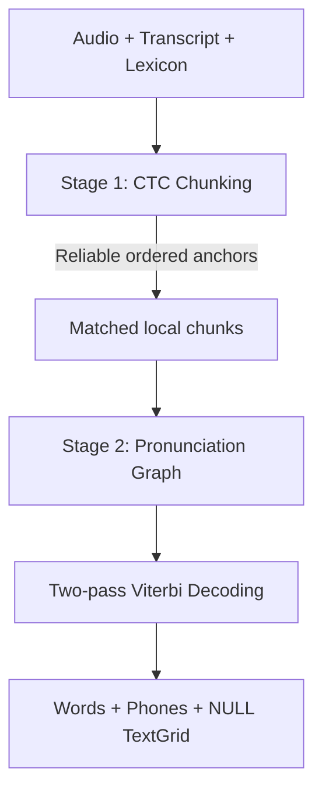

<div align="center">

# 🌊 FlexAligner

### Robust Speech-Text Alignment from Signal to Symbol

[](http://phonetics.ustc.edu.cn/)
[](https://pypi.org/project/flexaligner/)
[](https://www.python.org/)
[](https://github.com/USTCPhonetics/FlexAligner/actions/workflows/ci.yml)
[](LICENSE)
[](https://huggingface.co/USTCPhonetics/FlexAligner)

**A Neural-Based Forced Alignment Framework for "Wild" Real-World Data**<br>
**面向真实非受控数据的深度学习强鲁棒性对齐工具**

[**Introduction**](#-introduction) | [**项目简介**](#-简介) | [**Quick Start**](#-quick-start--快速开始) | [**Technical Details**](#-工作原理--technical-details) | [**Citation**](#-引用--citation)

</div>

---

## 📖 Introduction

**FlexAligner** is a wav2vec 2.0-based forced-alignment framework for speech and
transcripts that do not match perfectly. Real-world recordings often contain
background noise, laughter, hesitations, untranscribed events, or local
transcription omissions. Conventional aligners may force these regions into
nearby words and produce misleading boundaries.

FlexAligner addresses this problem in two stages. It first uses CTC to find
reliable, ordered transcript anchors, then applies a constrained pronunciation
graph and two-pass Viterbi decoding inside the matched regions. The result is a
Praat TextGrid with word and phone boundaries; uncovered time is represented
explicitly as `NULL` rather than hidden inside neighboring labels.

The `0.3.0a1` public alpha supports **English and Mandarin, CPU, single-file
alignment**. GPU inference, corpus/batch alignment, Web services, automatic
language detection, and calibrated confidence scores are not yet available.

## 🌏 简介

**FlexAligner** 是一个基于 wav2vec 2.0 的语音—文本强制对齐框架，面向真实语料中
并不完美一致的音频与转写。背景噪音、笑声、停顿、未转写声音事件或局部漏记，
都可能使传统对齐器把不匹配时段强行挤入相邻词或音素。

FlexAligner 先通过 CTC 寻找可靠且顺序一致的文本锚点，再在已匹配区域内构建受约束的
发音图，使用两遍 Viterbi 解码估计词和音素边界。输出为 Praat TextGrid，未覆盖时段
使用明确的 `NULL` 区间表示，而不是被隐藏在相邻标签中。

`0.3.0a1` 公开 alpha 当前支持**英语和普通话、CPU、单文件对齐**。GPU 推理、语料库/
批处理对齐、Web 服务、自动语言识别和经校准的置信度尚未提供。

### 🌟 Key Features / 核心优势

- **🛡️ Tolerance to Mismatch / 局部不一致容错：** CTC anchors isolate reliable
  regions without forcing every acoustic event into the transcript. CTC 锚点先隔离可靠
  区域，不强迫每个声学事件都匹配文本。
- **🎯 Word and Phone Boundaries / 词与音素边界：** Continuous `words` and
  `phones` tiers cover the complete timeline, including leading, internal, and
  trailing `NULL` intervals. 两个 tier 连续覆盖完整时间轴。
- **🌍 English and Mandarin / 英语与普通话：** Pinned acoustic models,
  language-aware text handling, and local lexicon-first OOV G2P. 固定模型、语言相关的文本处理与
  词典优先的本地 OOV 发音兜底。
- **🔒 Local and Reproducible / 本地与可复现：** Acoustic models and G2P
  resources are cached locally for repeatable offline inference. 声学模型和 G2P 资源缓存在
  本地，可用于可复现的离线推理。

---

## 🚀 Quick Start / 快速开始

### 1. Install / 安装

The recommended installation includes **all currently supported language,
inference, and audio components**. It supports Python 3.10–3.12.

推荐安装包含**当前全部语言、推理和音频增量能力**，支持 Python 3.10–3.12。

```bash
python -m pip install "flexaligner[inference,en,zh,audio]==0.3.0a1"
```

<details>
<summary><strong>CPU-only Linux installation / CPU-only Linux 安装</strong></summary>

```bash
python -m pip install torch==2.3.1 --index-url https://download.pytorch.org/whl/cpu
python -m pip install "flexaligner[inference,en,zh,audio]==0.3.0a1"
```

</details>

### 2. Prepare the input / 准备输入

You need an audio file, a UTF-8 transcript, and a UTF-8 pronunciation
dictionary. Each dictionary line has the form `WORD PHONE1 PHONE2 ...`; phones
must match the selected alignment model.

需要准备音频、UTF-8 转写文本和 UTF-8 发音词典。词典每行格式为
`WORD PHONE1 PHONE2 ...`，音素必须与所选 Aligner 模型的词表一致。

By default, audio must be an uncompressed 16 kHz mono PCM16 WAV. The recommended
installation also provides explicit conversion for other audio formats.

默认音频必须是未压缩的 16 kHz 单声道 PCM16 WAV；推荐安装同时提供其他音频格式的
显式转换能力。

### 3. Fetch a model / 下载模型

```bash
# English / 英语
flexaligner models fetch --language en

# Mandarin / 普通话
flexaligner models fetch --language zh
```

Models are downloaded to the local Hugging Face cache after confirmation. Both
the official Hugging Face endpoint and `hf-mirror.com` are supported.

模型经用户确认后下载到本地 Hugging Face 缓存，支持 Hugging Face 官方端点和
`hf-mirror.com`。

### 4. Align / 执行对齐

```bash
# English / 英语
flexaligner align \
  --language en \
  --audio recording.wav \
  --text-file transcript.txt \
  --lexicon english.dict \
  --output recording.TextGrid
```

For Mandarin, use the same interface with `--language zh`, a Mandarin
transcript, and a compatible Mandarin dictionary:

普通话使用相同接口，将语言切换为 `--language zh`，并提供普通话文本和兼容词典：

```bash
flexaligner align \
  --language zh \
  --audio mandarin.wav \
  --text-file mandarin.txt \
  --lexicon mandarin.dict \
  --output mandarin.TextGrid
```

---

## 💻 Usage / 使用说明

### Pronunciation fallback / 发音兜底

Dictionary entries take priority. Words not found in the dictionary can be
handled by the local English or Mandarin G2P frontend, with a warning in the
CLI. Important or ambiguous pronunciations should be specified in the
dictionary.

词典条目始终优先。词典未收录的词可由本地英语或普通话 G2P 前端处理，CLI 会同时
给出警告。重要或存在歧义的发音应明确写入词典。

### Audio conversion / 音频转换

```bash
flexaligner audio convert input.flac canonical.wav
flexaligner align ... --audio-policy auto-resample   # WAV input only / 仅 WAV
flexaligner align ... --audio-policy multi-format    # PyAV decoding / PyAV 解码
```

Audio conversion is explicit; the default policy never converts silently.
音频转换必须显式启用，默认策略不会静默转码或重采样。

### Python API

The Python API accepts explicit local model directories and can be integrated
into reproducible research pipelines. Python API 接受明确的本地模型目录，可集成到可复现的
研究流程中。

```python
from pathlib import Path

from flexaligner import AlignmentRequest, FlexAligner, LocalModelBundle, TextGridOutput

models = LocalModelBundle(
    chunker_dir=Path("/local/models/en/chunker"),
    aligner_dir=Path("/local/models/en/aligner"),
)

with FlexAligner(models=models, lexicon_path=Path("english.dict")) as aligner:
    result = aligner.align(
        AlignmentRequest(
            audio_path=Path("recording.wav"),
            transcript=Path("transcript.txt").read_text(encoding="utf-8"),
            output=TextGridOutput(path=Path("recording.TextGrid")),
            utterance_id="recording",
        )
    )

print(result.output_sha256)
```

---

## 🏗️ 工作原理 / Technical Details


```mermaid
graph TD
    Input[Audio + Transcript + Lexicon] --> B[Stage 1: CTC Chunking]
    B -->|Reliable ordered anchors| C[Matched local chunks]
    C --> D[Stage 2: Pronunciation Graph]
    D --> E[Two-pass Viterbi Decoding]
    E --> F[Words + Phones + NULL TextGrid]
```

1. **Macro-Segmentation / 宏观切分：** CTC finds reliable transcript anchors while
   tolerating untranscribed acoustic events. CTC 在容忍未转写声学事件的同时寻找
   可靠文本锚点。
2. **Micro-Alignment / 微观对齐：** A constrained pronunciation graph and two-pass
   Viterbi decoder estimate word and phone boundaries inside each chunk. 受约束发音图和
   两遍 Viterbi 解码在每个片段内估计词与音素边界。

---

## 🗓️ Roadmap / 路线图

- [x] **Core Alignment Engine:** CTC chunking + local pronunciation-graph alignment
- [x] **English and Mandarin:** CPU single-file CLI and Python API
- [x] **Continuous TextGrid:** complete `words`/`phones` timeline with `NULL`
- [x] **Model Retrieval:** local caching for English and Mandarin models
- [x] **Local OOV G2P:** lexicon-first English and Mandarin pronunciation fallback
- [x] **Audio Frontend:** explicit multi-format decoding, resampling, and conversion
- [x] **PyPI Public Alpha:** `flexaligner==0.3.0a1`
- [ ] **GPU and Corpus/Batch Processing**
- [ ] **Web Service and Confidence Calibration**

## 👨‍💻 Authors & Affiliation / 作者与机构

```text
Yiming Wang (王一鸣) - University of Science and Technology of China (USTC)
Jiahong Yuan (袁家宏) - University of Science and Technology of China (USTC)
```

## 📜 引用 / Citation

If you use FlexAligner in your research, please cite / 如果您在研究中使用 FlexAligner，请引用：

```bibtex
@misc{flexaligner2026,
  title        = {FlexAligner: Robust Speech--Text Alignment via CTC Chunking and Local Cross-Entropy Alignment},
  author       = {Wang, Yiming and Yuan, Jiahong},
  year         = {2026},
  publisher    = {GitHub},
  journal      = {GitHub repository},
  howpublished = {\url{https://github.com/USTCPhonetics/FlexAligner}},
  organization = {University of Science and Technology of China}
}
```

## ©️ Copyright & License / 版权与许可证

Copyright (c) 2026 WANG Yiming

FlexAligner is released under the [MIT License](LICENSE). The optional
`flexaligner-g2p-en` distribution contains a checkpoint derived from
`g2p-en==2.1.0`, redistributed under Apache-2.0 with its license and attribution
notice.

FlexAligner 依 [MIT License](LICENSE) 发布。可选的 `flexaligner-g2p-en` 发行包包含源自
`g2p-en==2.1.0` 的 checkpoint，依 Apache-2.0 再分发，并随包提供许可证和归属声明。

<div align="center"><sub>Built by USTCPhonetics.</sub></div>
